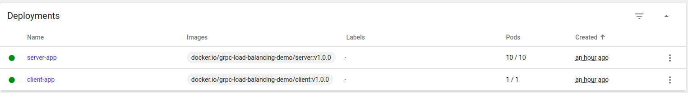

# Explore: GRPC Load Balancing

This repo holds my exploration on load balancing a grpc system. Currently, my team has one backend application that have high traffic (100k> rps from 9 pods). I'm not satisfied with current solution with the use of kubernetes' headless service. My team still see that there is an imbalance between the pods.

## Setup

I create two simple application to help me demonstrate that the current solution is not working properly. These two app is a client and server model. Each application has an UUID that I used as indentifier. The client has RESTful API endpoint, which upon called, will also make a gRPC call to the server application. This is the gRPC and RESTful contract.

```json
// RESTful contract
  "detail": {
    "from: <server's_app_id>": <number_of_call>
  }
```

```proto
// protocol buffer contract
message Echo {
    string message = 1;
}

service EchoServer {
    rpc CallEcho(Echo) returns(Echo); 
}
```

This is the deployment setup inside kubernetes.


Basically, the client app will count how many variance of the server app that serve its request. With this, we can conclude whether the request is well balanced or not.

## Current Result

When I test the response of the client app. I found this response.

```json
{
  "detail": {
    "from: 2a63ca4d-193f-4ec8-b9d3-49a39548bb95 replied by: 4bcbc60a-5700-4313-8772-c2a3ceab0513": 1000
  }
}
```

This shows that out of 10 server app's pod, only one serving the traffic.

## Load Balancing with Envoy

Envoy can act as intermediary proxy between client and server application. Therefore, we can decouple connection between those two apps. The deployment configuration for `round_robin` load balancer algorithm is on [envoy](envoy/) folder.

In order to work with envoy, we need to add a file configuration or edit an existing one. In this docs, I will add a new file and run envoy with it. The main part of the configuration is:

```yaml
      listeners:
        - name: echo_server_listener
          address:
            socket_address:
              address: 0.0.0.0
              port_value: 80
```

This part has responsibility to open a port at envoy. We should direct our `targetPort` at kubernetes' service towards this port. The `0.0.0.0` IP means envoy will receive traffic from all network interface on the container.

```yaml
                    route_config:
                      name: echo_server_route
                      virtual_hosts:
                        - name: echo_server_service
                          domains: ["*"]
                          routes:
                            - match:
                                prefix: "/"
                              route:
                                cluster: echo_server_cluster
```

In this part, we configure the traffic coming from its listener is directed to `echo_server_cluster`.

```yaml
      clusters:
        - name: echo_server_cluster
          type: strict_dns
          lb_policy: round_robin
          http2_protocol_options: {}
          load_assignment:
            cluster_name: echo_server_cluster
            endpoints:
              - lb_endpoints:
                  - endpoint:
                      address:
                        socket_address:
                          address: server-app-service
                          port_value: 8080
```

In this part, we declare our backend cluster. We use `strict_dns` to tell envoy to continously and asynchronusly resolve specific `address` to the DNS. Besides `strict_dns`, envoy also support this type:

1. static: This configuration requirer the configurator to declare the upstream backend.
2. logical DNS: This configuration is similiar with `strict_dns`. But, this configuration will only ask for name resolution at start up time.
3. Envoy discovery service (EDS): This is the recommended method if we want to use envoy to its full potential. But, this type will require us to install a [control panel](https://github.com/envoyproxy/go-control-plane).
4. Original destination: [docs](https://www.envoyproxy.io/docs/envoy/latest/intro/arch_overview/upstream/service_discovery#:~:text=Original%20destination%20cluster,upstream%20HTTP%20connections.)
5. Custom Cluster: [docs](https://www.envoyproxy.io/docs/envoy/latest/intro/arch_overview/upstream/service_discovery#:~:text=Envoy%20also%20supports,the%20following%20section.)

[Full Docs about envoy's service discovery](https://www.envoyproxy.io/docs/envoy/latest/intro/arch_overview/upstream/service_discovery)

## Result

This is the result with curl request

```bash
curl localhost:9090/echo?iter=1000 | jq
```

```json
{
  "detail": {
    "from: e904e52c-1db9-4c85-8943-ca227a0c91ab replied by: 1505b503-41e5-4ab5-a835-92dd253f11a8": 100,
    "from: e904e52c-1db9-4c85-8943-ca227a0c91ab replied by: 58cf38b1-c8c3-4efd-8ba4-195703521d08": 100,
    "from: e904e52c-1db9-4c85-8943-ca227a0c91ab replied by: 5e1c5dd3-7792-428f-a2eb-3e822a7130ef": 100,
    "from: e904e52c-1db9-4c85-8943-ca227a0c91ab replied by: 689cff1c-9ce6-466b-b967-aa28c0c98a3a": 100,
    "from: e904e52c-1db9-4c85-8943-ca227a0c91ab replied by: 6ff4bb73-606e-4a80-8ac8-21721a68de6a": 100,
    "from: e904e52c-1db9-4c85-8943-ca227a0c91ab replied by: 85ae2e49-001e-4947-8c69-5340ad73ad8b": 100,
    "from: e904e52c-1db9-4c85-8943-ca227a0c91ab replied by: 955f8ad7-488e-4171-8ba0-6e1a6ae6f314": 100,
    "from: e904e52c-1db9-4c85-8943-ca227a0c91ab replied by: b5a9535d-8a61-43d5-8cef-ec0717a8ce95": 100,
    "from: e904e52c-1db9-4c85-8943-ca227a0c91ab replied by: d54a4506-df07-4ef3-8247-673e3b3f1391": 100,
    "from: e904e52c-1db9-4c85-8943-ca227a0c91ab replied by: f9a546b8-6931-48d8-bf20-15c8b4b743bd": 100
  }
}

```

## Scaling Elasticity Issue

I notice that the traffic load is not balanced directly after scale up event. This trait is similiar with the client side load balancing.

## Latency Test

This table shows latency between client <-> envoy <-> server. The client will call the server `iter` times syncrhonously. Time unit is on milliseconds.

| iteration/round | 1    | 2    | 3    | 4    | 5    |
|-----------------|------|------|------|------|------|
| 10              | 37   | 120  | 40   | 47   | 124  |
| 100             | 819  | 778  | 832  | 880  | 734  |
| 1000            | 7455 | 7094 | 7250 | 8141 | 8083 |
